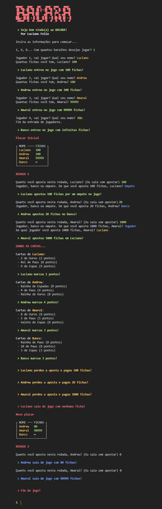

### Software Design - Exercise program #1




## Getting Started

1. Clone this repository with the following command:
    ```bash
    $ git clone https://github.com/FelixLuciano/bacara-game.git
    ```
2. Enter the folder:
    ```bash
    $ cd bacara-game
    ```
3. Then run the game:
    ```bash
    $ python src\index.py
    ```
4. **Have fun!**
